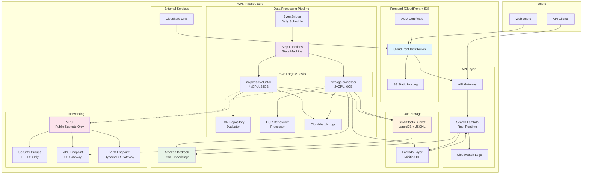
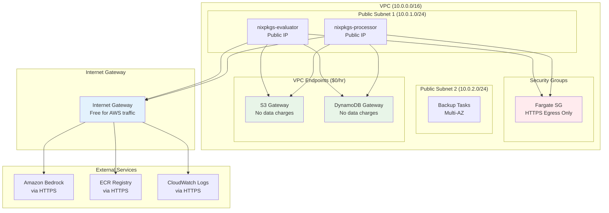
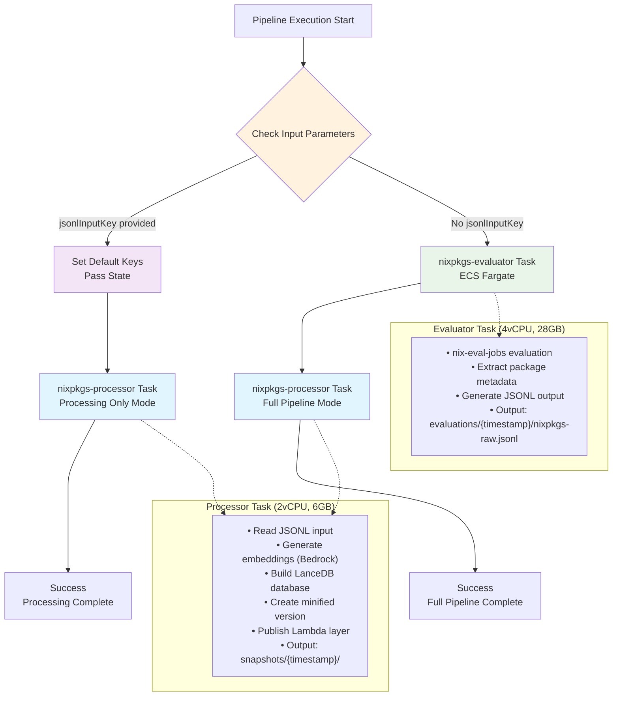
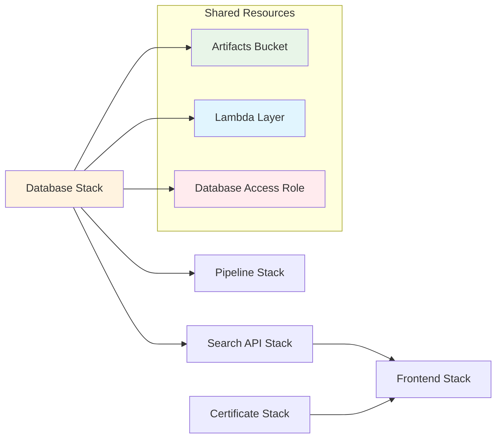

# fdnix CDK Infrastructure

This directory contains the AWS CDK (Cloud Development Kit) infrastructure for the **fdnix** hybrid search engine. The infrastructure is designed as a serverless, cost-optimized system that processes nixpkgs data and provides hybrid vector + keyword search capabilities.

## Architecture Overview

The fdnix infrastructure consists of five main stacks that work together to provide a complete search solution:



## Key Features

- **Cost-Optimized**: $0/hour infrastructure using public subnets and Gateway VPC endpoints
- **Serverless**: Lambda-based search API with automatic scaling
- **Hybrid Search**: Vector embeddings + traditional keyword search
- **Daily Updates**: Automated processing of latest nixpkgs data
- **Production Ready**: SSL certificates, CDN, proper security groups

## Stack Details

### 1. Database Stack (`FdnixDatabaseStack`)

**Purpose**: Core data storage and Lambda layer management

**Components**:
- **S3 Artifacts Bucket**: Stores LanceDB files, JSONL evaluations, and dependency graphs
  - Versioned with 30-day retention for old versions
  - SSL enforcement and block public access
- **Lambda Layer**: Contains minified LanceDB dataset for fast Lambda access
  - Optimized for search performance with essential data only
  - Updated automatically by the data processing pipeline
- **IAM Roles**: Database access permissions for Lambda and ECS tasks

**Cost**: ~$5-20/month (S3 storage only, no compute charges)

### 2. Pipeline Stack (`FdnixPipelineStack`) 

**Purpose**: Data processing orchestration and container execution

**Components**:
- **VPC with Cost Optimization**:
  - Public subnets only (no NAT Gateway = $45/month savings)
  - Gateway VPC endpoints for S3/DynamoDB (no hourly fees)
  - Security groups allowing only HTTPS egress
  
- **ECS Cluster with Fargate Tasks**:
  - **nixpkgs-evaluator**: 4vCPU, 28GB RAM for nix-eval-jobs
  - **nixpkgs-processor**: 2vCPU, 6GB RAM for data processing
  - ECR repositories with lifecycle policies (max 10 images)
  
- **Step Functions State Machine**: Orchestrates conditional pipeline execution
  - Full pipeline: evaluation → processing
  - Processing-only: skip evaluation, process existing data
  
- **EventBridge**: Daily scheduled execution at 2 AM UTC

**Cost**: ~$20-40/month (runs ~2 hours daily, ECS Fargate pricing)

### 3. Search API Stack (`FdnixSearchApiStack`)

**Purpose**: High-performance search API with hybrid capabilities

**Components**:
- **Lambda Function**: 
  - Rust-based custom runtime (PROVIDED_AL2023)
  - 1GB memory, 30-second timeout
  - Includes minified LanceDB via Lambda layer
  
- **API Gateway**:
  - REST API with CORS support
  - Rate limiting: 100 req/s, 10K req/day
  - Health check endpoint for monitoring
  
- **Bedrock Integration**: Real-time embedding generation for hybrid search
- **CloudWatch Logs**: Function logging with 1-month retention

**Cost**: ~$5-15/month (Lambda execution + API Gateway requests)

### 4. Frontend Stack (`FdnixFrontendStack`)

**Purpose**: Static site hosting with global CDN distribution

**Components**:
- **S3 Static Hosting**: Private bucket with versioning enabled
- **CloudFront Distribution**:
  - Global CDN with HTTP/2 and HTTP/3 support
  - Origin Access Control (OAC) for secure S3 access
  - API proxy behavior for `/api/*` paths
  - SPA routing with 404 → index.html fallback
- **Deployment Automation**: S3 deployment with cache invalidation

**Cost**: ~$1-5/month (CloudFront + S3 hosting)

### 5. Certificate Stack (`FdnixCertificateStack`)

**Purpose**: SSL/TLS certificate management for custom domains

**Components**:
- **ACM Certificate**: DNS-validated certificate for `fdnix.com` and `www.fdnix.com`
- **DNS Integration**: Works with Cloudflare DNS management

**Cost**: $0 (ACM certificates are free)

## Networking Architecture

The networking design prioritizes cost optimization while maintaining security:



### Cost-Optimized Design Decisions

1. **No NAT Gateway**: Public subnets with public IPs save $45/month per NAT Gateway
2. **Gateway VPC Endpoints**: S3 and DynamoDB access with no hourly charges or data transfer fees
3. **Security Groups**: Restrict egress to HTTPS only (ports 443/80) for security
4. **Multi-AZ**: 2 availability zones for high availability without extra NAT costs

## Step Functions Workflow

The pipeline uses a conditional Step Functions state machine that supports two execution modes:



### Execution Modes

#### 1. Full Pipeline (Evaluation + Processing)
**Input**: `{}` or any input without `jsonlInputKey`
**Flow**: `EvaluatorTask` → `ProcessorTaskWithEvaluatorOutput`
**Duration**: ~2 hours
**Use Case**: Daily scheduled runs, complete data refresh

#### 2. Processing Only (Skip Evaluation)
**Input**: `{"jsonlInputKey": "evaluations/2025-09-10/nixpkgs-raw.jsonl"}`
**Flow**: `SetDefaultKeys` → `ProcessorTask`
**Duration**: ~1 hour  
**Use Case**: Reprocessing existing evaluations, testing processor changes

### Input Parameters

- `jsonlInputKey` (conditional): S3 key to existing JSONL evaluation output
- `lancedbDataKey` (optional): S3 key for main LanceDB output (auto-generated if not provided)
- `lancedbMinifiedKey` (optional): S3 key for minified LanceDB output 
- `dependencyS3Key` (optional): S3 key for dependency graph output

## Deployment and Usage

### Prerequisites

1. **AWS CLI configured** with appropriate permissions
2. **Node.js 18+** and npm installed  
3. **AWS CDK v2** installed globally: `npm install -g aws-cdk`
4. **Build artifacts** prepared:
   ```bash
   # Build search lambda
   cd packages/search-lambda && nix build .#lambda-package
   
   # Build frontend
   cd packages/frontend && npm run build
   ```

### Stack Deployment Order

The stacks have dependencies and must be deployed in order:

```bash
# 1. Database stack (foundation)
cdk deploy FdnixDatabaseStack

# 2. Certificate stack (independent)  
cdk deploy FdnixCertificateStack

# 3. Pipeline stack (depends on database)
cdk deploy FdnixPipelineStack

# 4. Search API stack (depends on database)
cdk deploy FdnixSearchApiStack

# 5. Frontend stack (depends on search API and certificate)
cdk deploy FdnixFrontendStack
```

Or deploy all at once:
```bash
cdk deploy --all
```

### Environment Variables

Configure these environment variables before deployment:

```bash
export CDK_DEFAULT_ACCOUNT=123456789012
export CDK_DEFAULT_REGION=us-east-1
export FDNIX_DOMAIN_NAME=fdnix.com        # Optional: custom domain
export FDNIX_STAGE=prod                   # Optional: environment stage  
export FDNIX_STACK_PREFIX=Fdnix           # Optional: stack naming prefix
```

### DNS Configuration (Cloudflare)

After frontend stack deployment:

1. Get the CloudFront distribution domain from stack outputs
2. In Cloudflare DNS, create:
   - **A record**: `fdnix.com` → CloudFront domain (flattened/CNAME flattening)
   - **CNAME record**: `www.fdnix.com` → CloudFront domain
3. Set SSL/TLS mode to **Full (strict)**
4. Validate ACM certificate via DNS (add CNAME records from ACM)

### Manual Pipeline Execution

Execute the Step Functions state machine manually:

```bash
# Full pipeline
aws stepfunctions start-execution \
    --state-machine-arn arn:aws:states:us-east-1:ACCOUNT:stateMachine:PipelineStateMachine \
    --input '{}'

# Processing only (skip evaluation)
aws stepfunctions start-execution \
    --state-machine-arn arn:aws:states:us-east-1:ACCOUNT:stateMachine:PipelineStateMachine \
    --input '{"jsonlInputKey": "evaluations/2025-09-10/nixpkgs-raw.jsonl"}'
```

## CDK Structure and Patterns

### File Organization

```
packages/cdk/
├── bin/
│   └── fdnix.ts                 # CDK app entry point
├── lib/
│   ├── certificate-stack.ts     # ACM certificate
│   ├── database-stack.ts        # S3, Lambda layer, IAM
│   ├── docker-build-construct.ts # Reusable Docker build
│   ├── frontend-stack.ts        # S3, CloudFront, deployment
│   ├── pipeline-stack.ts        # Step Functions, ECS, VPC
│   ├── search-api-stack.ts      # Lambda, API Gateway
│   └── empty-layer/            # Placeholder Lambda layer
├── cdk.json                    # CDK configuration
├── package.json               # Dependencies
└── tsconfig.json             # TypeScript config
```

### Key Patterns Used

1. **Stack Dependencies**: Explicit dependencies between stacks using `addDependency()`
2. **Cross-Stack References**: Public readonly properties for sharing resources
3. **Environment Abstraction**: Environment variables with sensible defaults
4. **Resource Tagging**: Consistent tagging strategy across all resources
5. **Construct Reuse**: `DockerBuildConstruct` for reusable container builds
6. **Validation**: Runtime checks for build artifacts before deployment

### Inter-Stack Communication



### Naming and Tagging Strategy

**Stack Naming**: `{Prefix}{Stage}{StackName}` (e.g., `FdnixProdDatabaseStack`)

**Resource Tags**:
- `Project: fdnix` - Project identifier
- `Component: database|pipeline|api|frontend|certificate` - Stack component
- `Environment: production|staging|dev` - Environment stage
- `ManagedBy: CDK` - Management tool
- `Repository: fdnix` - Source repository

### Security Considerations

1. **Principle of Least Privilege**: Each IAM role has minimal required permissions
2. **Network Isolation**: Security groups restrict traffic to HTTPS only
3. **Encryption**: S3 server-side encryption and SSL enforcement
4. **Access Control**: Origin Access Control (OAC) for CloudFront → S3
5. **Secrets Management**: No hardcoded credentials or secrets in code

## Cost Estimation

| Component | Monthly Cost | Notes |
|-----------|--------------|-------|
| S3 Storage | $5-20 | LanceDB files, JSONL data |
| ECS Fargate | $20-40 | 2 hours daily execution |  
| Lambda | $5-15 | Search API execution |
| CloudFront | $1-5 | CDN distribution |
| API Gateway | $1-10 | API requests |
| **Total** | **$32-90** | Varies by usage |

Additional one-time costs:
- ECR storage: ~$1-2/month for container images
- CloudWatch Logs: ~$1-5/month for log retention

## Monitoring and Observability

- **CloudWatch Logs**: All components have structured logging
- **CloudWatch Metrics**: ECS task metrics, Lambda performance, API Gateway metrics
- **Step Functions Console**: Visual pipeline execution tracking
- **X-Ray Tracing**: Available for Lambda functions (optional)

## Maintenance and Updates

- **Daily Pipeline**: Automatically processes latest nixpkgs data
- **Container Images**: Lifecycle policies limit ECR storage costs
- **Lambda Layers**: Automatically updated with new LanceDB versions
- **SSL Certificates**: Auto-renewal via ACM with DNS validation

---

**Next Steps**: 
1. Deploy the stacks in order
2. Configure DNS settings in Cloudflare
3. Monitor the first pipeline execution
4. Set up alerting for pipeline failures (optional)

For questions or issues, refer to the [main project documentation](../../README.md) or check the Step Functions execution logs in the AWS Console.