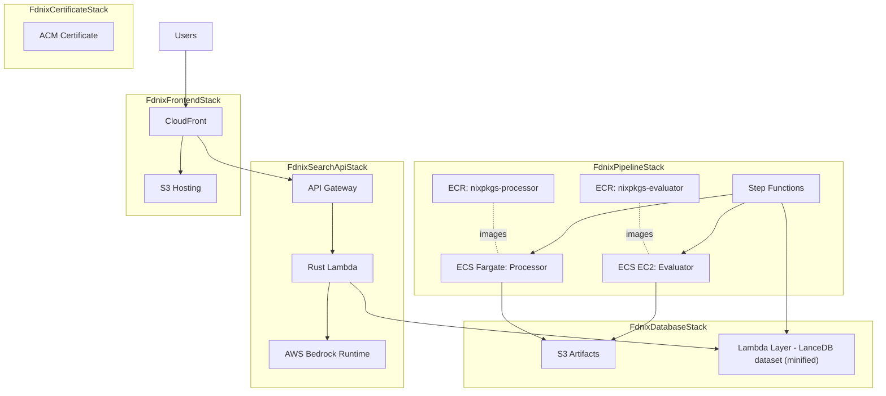
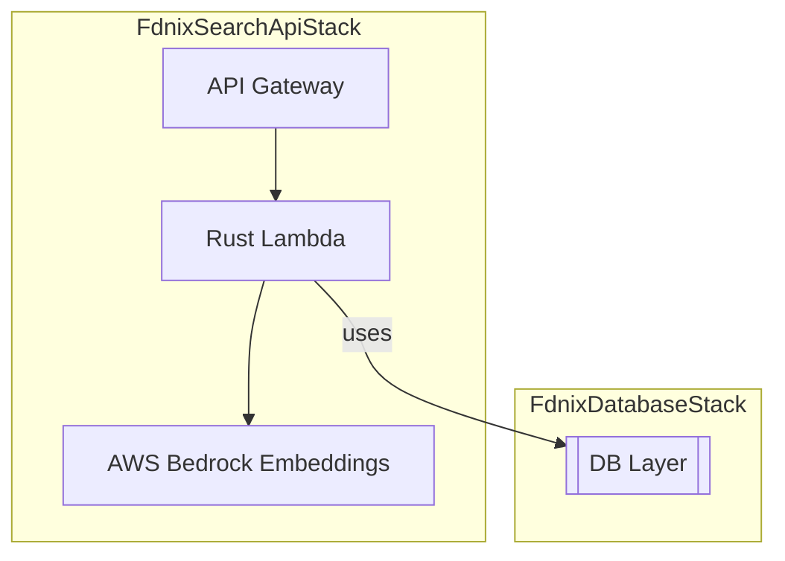
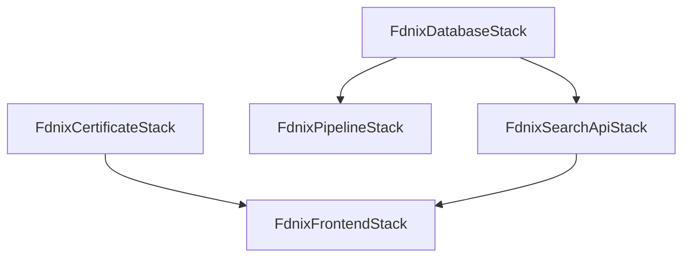

# fdnix CDK Infrastructure

This package contains the AWS CDK infrastructure definitions for the fdnix hybrid search engine. All AWS resources are prefixed with "fdnix-" for clear identification.

## Architecture Overview

The infrastructure consists of four main stacks, a certificate stack, and a set of constructs for building Docker images and Lambda layers.

1.  **Certificate Stack** - Provisions an ACM certificate for the custom domain.
2.  **Database Stack** - S3 artifact storage + Lambda Layer for the LanceDB dataset (minified).
3.  **Pipeline Stack** - Two-stage pipeline (EC2 evaluator + Fargate processor) orchestrated by Step Functions that builds the LanceDB dataset and publishes the Lambda layer.
4.  **Search API Stack** - A Rust Lambda-based search API with self-contained LanceDB runtime/dependencies and AWS Bedrock (Amazon Titan Embeddings) for query embeddings.
5.  **Frontend Stack** - Static site hosting with CloudFront (no CDK-managed custom domain).

## Architecture Diagram



## Data Pipeline Diagram

The data pipeline is now a two-stage workflow orchestrated by Step Functions. Stage 1 runs an EC2-based ECS task to evaluate nixpkgs. Stage 2 runs a Fargate-based ECS task to process metadata, (optionally) generate embeddings, build LanceDB databases, and publish the Lambda layer. You can also skip Stage 1 and run Stage 2 directly by providing an existing `jsonlInputKey`.

```mermaid
graph TD
    subgraph "FdnixPipelineStack"
        direction LR
        start((Start)) --> choice{jsonlInputKey?}
        choice -- no --> scale_up[Scale up EC2 ASG]\n(poll until InService)
        scale_up --> evaluator[Evaluator (ECS EC2)]
        evaluator --> scale_down[Scale down EC2 ASG]
        scale_down --> processor[Processor (ECS Fargate)]
        choice -- yes --> set_defaults[Set defaults]\n(lancedb/deps keys)
        set_defaults --> processor
        processor --> done((End))
    end

    subgraph "FdnixDatabaseStack"
        direction LR
        s3_artifacts[(S3 Artifacts)]
        db_layer[[Lambda Layer: LanceDB Dataset]]
    end

    evaluator -- writes JSONL --> s3_artifacts
    processor -- reads/writes (full + minified) --> s3_artifacts
    processor -- publishes minified to --> db_layer
```

## Search API Diagram

The search API is a Rust Lambda function fronted by an API Gateway. It uses a single Lambda layer to access the LanceDB minified dataset.



## Prerequisites

-   Node.js 18+ and npm
-   Rust toolchain (`rustup`, `cargo`) with musl target: `rustup target add x86_64-unknown-linux-musl` (if building without Nix)
-   Nix (recommended) for reproducible builds of the Lambda and native dependencies
-   Docker (optional) for containerized builds
-   AWS CLI configured with appropriate credentials
-   AWS CDK CLI installed (`npm install -g aws-cdk`)

## Idempotent Deployments

CloudFormation and CDK are designed for idempotent deployments. Re-running the same template should converge to the same state. Follow these practices to keep deploys predictable:

-   **Stable construct IDs**: Do not rename construct IDs of deployed resources; CDK maps them to CloudFormation Logical IDs.
-   **Avoid hardcoded physical names**: Let CDK generate names (S3 buckets, DynamoDB tables). If a fixed name is required, ensure it is unique and constant per environment.
-   **No dynamic name drift**: Avoid timestamps/random suffixes in names inside code. Use stack name or context for determinism.
-   **Review changes**: Run `npm run diff` (or `npx cdk diff`) to inspect change sets before deploy.
-   **Detect/resolve drift**: Use CloudFormation drift detection to find resources changed outside CDK; resolve by reverting manual edits or updating code.
    -   Example:
        -   `aws cloudformation detect-stack-drift --stack-name FdnixDatabaseStack`
        -   `aws cloudformation describe-stack-drift-detection-status --stack-drift-detection-id <id>`
-   **Idempotent custom resources**: If you add Lambda-backed custom resources, implement Create/Update/Delete to be safe on retries and re-runs.
-   **Deterministic IAM**: Keep policy documents stable; avoid non-deterministic statements that cause rewrites each deploy.

Tip: Use `npm run diff` regularly during development to validate idempotency and avoid unintended replacements.

## Installation

From this folder (`packages/cdk`):

```bash
npm install
```

## Configuration

### Environment Variables

-   `CDK_DEFAULT_ACCOUNT` - AWS account ID
-   `CDK_DEFAULT_REGION` - AWS region (defaults to us-east-1)
-   `FDNIX_DOMAIN_NAME` - Custom domain name (defaults to fdnix.com)

Embeddings configuration:

-   Runtime (API, AWS Bedrock real-time):
    -   `AWS_REGION` - Region for Bedrock Runtime (Lambda default region is used if not set).
    -   `BEDROCK_MODEL_ID` - Embedding model id (default: `amazon.titan-embed-text-v2:0`).
    -   `BEDROCK_OUTPUT_DIMENSIONS` - Embedding dimensions (default: `256`).

-   Pipeline processor (real-time; disabled by default):
    -   `ENABLE_EMBEDDINGS` - Set to `true` to generate embeddings during processing (default: `false`).
    -   `BEDROCK_MODEL_ID` - Embedding model id for processor (default: `amazon.titan-embed-text-v2:0`).
    -   `BEDROCK_OUTPUT_DIMENSIONS` - Embedding dimensions (default: `256`).
    -   `BEDROCK_MAX_RPM` - Requests per minute limit (e.g., `600`).
    -   `BEDROCK_MAX_TOKENS_PER_MINUTE` - Token throughput cap.
    -   `PROCESSING_BATCH_SIZE` - Batch size for processing/embedding (default tuned for rate limiting).

### AWS Prerequisites

Before deploying, ensure you have:

1.  AWS CDK bootstrapped in your account/region:
    ```bash
    npx cdk bootstrap
    ```

2.  Appropriate IAM permissions for creating:
    -   S3 buckets
    -   Lambda functions and layers
    -   API Gateway
    -   CloudFront distributions
    -   ECS clusters and task definitions
    -   Step Functions state machines
    -   EventBridge rules
    -   IAM roles and policies
    -   ECR repositories

## Deployment

### Deploy All Stacks

From this folder (`packages/cdk`):

```bash
# Build the Rust Lambda bootstrap first (required for API)
# Recommended: Nix build places bootstrap at ../search-lambda/result/bin/bootstrap
(cd ../search-lambda && nix build)

# Then deploy all stacks
npm run deploy
```

### Deploy Individual Stacks

```bash
# Ensure the Rust Lambda is built before deploying the API stack
(cd ../search-lambda && nix build)

npx cdk deploy FdnixCertificateStack
npx cdk deploy FdnixDatabaseStack
npx cdk deploy FdnixPipelineStack
npx cdk deploy FdnixSearchApiStack
npx cdk deploy FdnixFrontendStack
```

### View Planned Changes

```bash
npm run diff
```

### Synthesize CloudFormation Templates

```bash
# Building the Lambda is not strictly required for synth, but recommended
(cd ../search-lambda && nix build)

npm run synth
```

## Stack Details

### Certificate Stack (`FdnixCertificateStack`)

**Resources:**

-   `fdnix-certificate` - ACM certificate for the custom domain.

**Key Features:**

-   Provisions a certificate in `us-east-1` for use with CloudFront.
-   DNS validation records must be created in your DNS provider.

### Database Stack (`FdnixDatabaseStack`)

**Resources:**

-   `fdnix-artifacts` - S3 bucket for pipeline artifacts (stores the full and minified LanceDB dataset files).
-   `fdnix-db-layer` - Lambda Layer that packages the minified LanceDB dataset under `/opt/fdnix/lancedb`.
-   `fdnix-database-access-role` - IAM role for artifact access and layer publishing.

**Key Features:**

-   S3 versioning with lifecycle management (30-day retention).
-   Encryption at rest with S3-managed keys.
-   The `databaseLayer` is populated by the pipeline with the minified LanceDB dataset.

### Pipeline Stack (`FdnixPipelineStack`)

**Resources:**

-   `fdnix-pipeline-vpc` - Cost-optimized VPC (no NAT), IPv6 egress-only internet.
-   `fdnix-processing-cluster` - ECS cluster (EC2 capacity provider + Fargate).
-   `fdnix-evaluator-asg` - Auto Scaling Group + launch template (EC2 i4i.xlarge) for Stage 1.
-   `fdnix-nixpkgs-evaluator` - ECR repository for the evaluator image.
-   `fdnix-nixpkgs-processor` - ECR repository for the processor image.
-   CloudWatch Log Groups per stage.
-   `fdnix-daily-pipeline` - Step Functions state machine.
-   `fdnix-daily-pipeline-trigger` - EventBridge rule (daily at 2:00 AM UTC).

**Key Features:**

-   Two-stage pipeline: Stage 1 (Evaluator on ECS EC2) → Stage 2 (Processor on ECS Fargate).
-   Conditional skip: Provide `jsonlInputKey` to bypass evaluation and run processing only.
-   VPC with $0/hr baseline: no NAT Gateway; IPv6 egress-only with S3/DynamoDB Gateway Endpoints.
-   EC2 evaluator uses local NVMe on `i4i.xlarge` and auto-scales 0 → 1 → 0 around runs.
-   Fargate processor sized at 2 vCPU / 6 GB RAM with 40 GB ephemeral storage.
-   Two separate container images built via `DockerBuildConstruct` and pushed to ECR.
-   Layer publishing performed inside the processor container using the unversioned layer ARN from the Database stack.
-   CloudWatch logging, enhanced container insights, and restricted egress (80/443 over IPv6).

See `STEP_FUNCTION_USAGE.md` for input examples and execution modes.

### Search API Stack (`FdnixSearchApiStack`)

**Resources:**

-   `fdnix-search-api` - Rust Lambda function for hybrid search.
-   `fdnix-search-api-gateway` - API Gateway REST API.
-   Lambda Layer attached from Database Stack (contains LanceDB dataset only).

**Key Features:**

-   Hybrid search using LanceDB vector index (semantic) + keyword index from a local dataset.
-   Direct LanceDB access (no external databases required for vectors).
-   Real-time query embeddings via AWS Bedrock Runtime (Amazon Titan Embeddings).
-   CORS enabled for frontend integration.
-   Rate limiting and usage plans (100 req/sec, 10K/day).
-   Health check endpoint.
-   Implemented in Rust using AWS Lambda custom runtime (`PROVIDED_AL2023`).
-   LanceDB dataset accessed read-only at `/opt/fdnix/lancedb`.
-   All LanceDB dependencies are packaged with the function (no separate LanceDB library layer).

**API Endpoints:**

-   `GET /v1/search?q=<query>` - Main search endpoint.
    -   `q` (required): The search query.
    -   `limit` (optional): The number of results to return.
    -   `offset` (optional): The offset for pagination.
-   `GET /v1/health` - Health check.

### Frontend Stack (`FdnixFrontendStack`)

**Resources:**

-   S3 bucket for static assets (private, OAC-protected).
-   CloudFront distribution.
-   Origin Access Control (OAC).

**Key Features:**

-   Global CDN with edge caching.
-   No custom domain configured by CDK. Attach your domain and ACM cert manually after deploy (see “Custom Domain Setup”).
-   SPA routing support (404 -> index.html).
-   API proxying to the search API at path `/api/*`.
-   Frontend assets are deployed from the `frontend/dist` directory.

## Stack Dependencies

The stacks have the following dependencies:



Note: The frontend stack does not reference the certificate in code; the dependency exists only to provision the ACM certificate you will attach manually.

## Outputs

Each stack exports key resource identifiers:

-   **Certificate**: Certificate ARN.
-   **Database**: Artifacts bucket, layer ARNs/versions.
-   **Pipeline**: Repository URIs, state machine ARN.
-   **API**: API URL, function name.
-   **Frontend**: Distribution ID, domain names.

## Monitoring and Observability

-   CloudWatch logs for all Lambda functions and ECS tasks.
-   CloudWatch metrics and alarms (can be extended).
-   X-Ray tracing support (can be enabled).
-   VPC Flow Logs for pipeline network traffic.

## Security Features

-   All S3 buckets block public access.
-   Encryption at rest for all storage services (S3-managed keys).
-   IAM roles follow the principle of least privilege.
-   Lambda functions with minimal required permissions.
-   CloudFront configured with OAC; add response security headers later if needed.
-   API Gateway with throttling and usage plans.
-   VPC isolation for ECS processing tasks.

## Cost Optimization

-   Serverless-first architecture minimizes fixed costs.
-   S3 lifecycle policies for old versions.
-   CloudFront edge caching reduces origin requests.
-   ECR lifecycle policies limit image storage.

## Cleanup

To destroy all resources:

```bash
npm run destroy
```

**Warning:** This will permanently delete all data. Ensure you have backups if needed.

## Troubleshooting

### Common Issues

1.  **Bootstrap Required**: Ensure CDK is bootstrapped in your account.
2.  **Permission Denied**: Verify IAM permissions for CDK deployment.
3.  **Rust Lambda Build**: Ensure `(cd ../search-lambda && nix build)` completes successfully (produces `result/bin/bootstrap`).
4.  **Container Images**: ECR repositories need container images pushed before ECS tasks can run.
5.  **Custom Domain**: Ensure DNS records are properly configured in your DNS provider.
6.  **Evaluator capacity**: If the evaluator never starts, check the ASG desired capacity and ECS instance registration. The state machine scales it up automatically, polls until `InService`, and scales back down after.
7.  **Networking**: Tasks use IPv6 egress-only with S3/DynamoDB Gateway Endpoints. If pulling packages fails, allow HTTP/HTTPS egress (ports 80/443) as configured.

### Useful Commands

```bash
# List all stacks
npx cdk list

# View stack dependencies
npx cdk tree

# Check CDK version
npx cdk --version

# Validate templates
npx cdk synth --validation
```

## Custom Domain Setup (Manual)

The frontend stack intentionally does not set a custom domain or attach a certificate. After deploy, set the domain manually:

1.  Validate the ACM certificate (us-east-1):
    - Deploy `FdnixCertificateStack`.
    - In ACM, copy the DNS validation CNAMEs for both apex and `www` SANs.
    - Add the validation CNAMEs in Cloudflare and wait for status to become Issued.
2.  Attach domain to CloudFront:
    - Open the frontend CloudFront distribution.
    - Edit settings and add Alternate domain names: `fdnix.com`, `www.fdnix.com`.
    - Select the validated ACM certificate from `us-east-1` and save changes.
3.  Configure Cloudflare DNS:
    - Create a CNAME for apex (`@`) pointing to the CloudFront domain (e.g., `dxxxx.cloudfront.net`). Cloudflare will apply CNAME flattening at the apex.
    - Create a CNAME for `www` pointing to the same CloudFront domain.
    - Optionally enable the proxy (orange cloud).
4.  Cloudflare SSL/TLS mode: set to "Full (strict)".

Notes:

- You can deploy the frontend before the certificate is issued; custom domain attachment can be done later without re-deploying CDK.
- The distribution initially serves only its default CloudFront domain until you complete the manual steps above.

## Next Steps

After successful deployment:

1.  **Set up the custom domain**: Attach the domain and cert to CloudFront, then configure Cloudflare DNS as described above.
2.  **Phase 2**: Build and deploy data processing containers.
3.  **Search Lambda (Rust)**: Ensure Nix build exists (`../search-lambda/result/bin/bootstrap`), set env flags, and validate API Gateway integration.
4.  **Frontend**: Build and deploy SolidJS frontend; point it to the API URL.
5.  **CI/CD**: Set up automated deployments.

## Support

For issues or questions:

-   Check CloudFormation events in AWS Console.
-   Review CloudWatch logs.
-   Verify IAM permissions.
-   Ensure all prerequisites are met.
Pipeline keys and inputs (Processor stage):

-   `JSONL_INPUT_KEY` - S3 key for the nixpkgs JSONL evaluation input (set by state machine or provided via `jsonlInputKey`).
-   `LANCEDB_DATA_KEY` - S3 key for the full LanceDB database output (defaults timestamped under `snapshots/`).
-   `LANCEDB_MINIFIED_KEY` - S3 key for the minified LanceDB output used by the Lambda layer (defaults timestamped under `snapshots/`).
-   `DEPENDENCY_S3_KEY` - S3 key for extracted dependency metadata (defaults timestamped under `dependencies/`).
-   `JSONL_OUTPUT_KEY` - S3 key used by the evaluator to write the JSONL output (timestamped under `evaluations/`).
