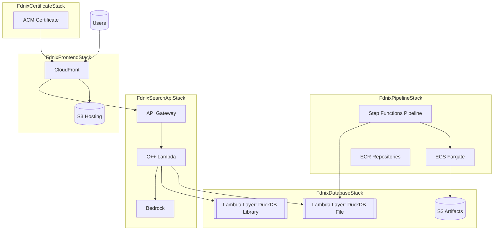
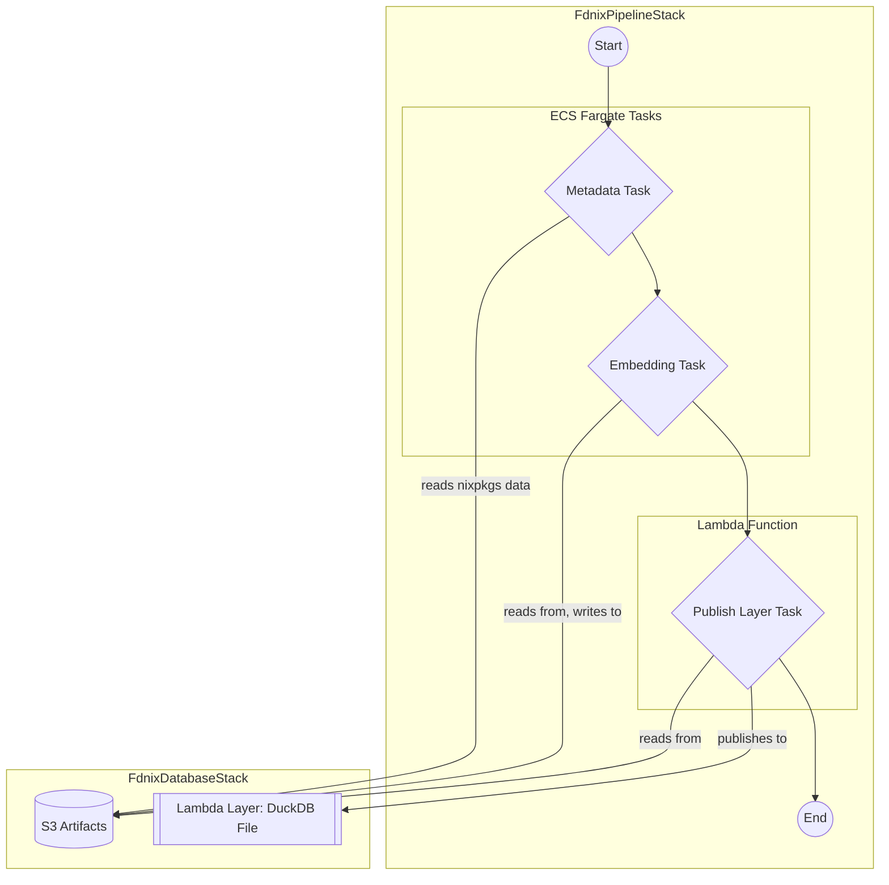
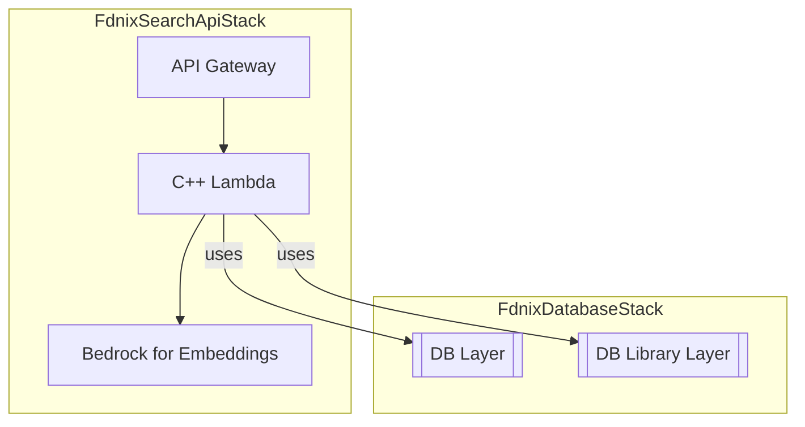
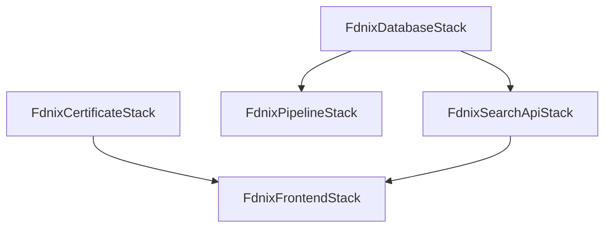

# fdnix CDK Infrastructure

This package contains the AWS CDK infrastructure definitions for the fdnix hybrid search engine. All AWS resources are prefixed with "fdnix-" for clear identification.

## Architecture Overview

The infrastructure consists of four main stacks, a certificate stack, and a set of constructs for building docker images and lambda layers.

1.  **Certificate Stack** - Provisions an ACM certificate for the custom domain.
2.  **Database Stack** - S3 artifact storage + Lambda Layers for the DuckDB file and the DuckDB shared library.
3.  **Pipeline Stack** - Data processing pipeline that builds the DuckDB file and publishes the Lambda layer.
4.  **Search API Stack** - A C++ Lambda-based search API using the DuckDB layers.
5.  **Frontend Stack** - Static site hosting with CloudFront.

## Architecture Diagram



## Data Pipeline Diagram

The data pipeline is orchestrated by a Step Functions state machine that runs a series of ECS Fargate tasks.



## Search API Diagram

The search API is a C++ Lambda function fronted by an API Gateway. It uses two Lambda layers to access the DuckDB database and the DuckDB shared library.



## Prerequisites

-   Node.js 18+ and npm
-   C++ toolchain for building the Lambda `bootstrap` (e.g., g++, clang++)
-   CMake 3.15+
-   Docker
-   AWS CLI configured with appropriate credentials
-   AWS CDK CLI installed (`npm install -g aws-cdk`)

## Idempotent Deployments

CloudFormation and CDK are designed for idempotent deployments. Re-running the same template should converge to the same state. Follow these practices to keep deploys predictable:

-   **Stable construct IDs**: Do not rename construct IDs of deployed resources; CDK maps them to CloudFormation Logical IDs.
-   **Avoid hardcoded physical names**: Let CDK generate names (S3 buckets, DynamoDB tables). If a fixed name is required, ensure it is unique and constant per environment.
-   **No dynamic name drift**: Avoid timestamps/random suffixes in names inside code. Use stack name or context for determinism.
-   **Review changes**: Run `npm run diff` (or `cdk diff`) to inspect change sets before deploy.
-   **Detect/resolve drift**: Use CloudFormation drift detection to find resources changed outside CDK; resolve by reverting manual edits or updating code.
    -   Example:
        -   `aws cloudformation detect-stack-drift --stack-name FdnixDatabaseStack`
        -   `aws cloudformation describe-stack-drift-detection-status --stack-drift-detection-id <id>`
-   **Idempotent custom resources**: If you add Lambda-backed custom resources, implement Create/Update/Delete to be safe on retries and re-runs.
-   **Deterministic IAM**: Keep policy documents stable; avoid non-deterministic statements that cause rewrites each deploy.

Tip: Use `npm run diff` regularly during development to validate idempotency and avoid unintended replacements.

## Installation

```bash
npm install
```

## Configuration

### Environment Variables

-   `CDK_DEFAULT_ACCOUNT` - AWS account ID
-   `CDK_DEFAULT_REGION` - AWS region (defaults to us-east-1)
-   `FDNIX_DOMAIN_NAME` - Custom domain name (defaults to fdnix.com)

### AWS Prerequisites

Before deploying, ensure you have:

1.  AWS CDK bootstrapped in your account/region:
    ```bash
    npx cdk bootstrap
    ```

2.  Appropriate IAM permissions for creating:
    -   S3 buckets
    -   Lambda functions and layers
    -   API Gateway
    -   CloudFront distributions
    -   ECS clusters and task definitions
    -   Step Functions state machines
    -   EventBridge rules
    -   IAM roles and policies
    -   ECR repositories

## Deployment

### Deploy All Stacks

```bash
# Build the C++ Lambda bootstrap first (required for API)
pnpm --filter search-lambda build

# Then deploy stacks
npm run deploy
```

### Deploy Individual Stacks

```bash
# Ensure the C++ Lambda is built before deploying the API stack
pnpm --filter search-lambda build

npx cdk deploy FdnixCertificateStack
npx cdk deploy FdnixDatabaseStack
npx cdk deploy FdnixPipelineStack
npx cdk deploy FdnixSearchApiStack
npx cdk deploy FdnixFrontendStack
```

### View Planned Changes

```bash
npm run diff
```

### Synthesize CloudFormation Templates

```bash
# Building the Lambda is not strictly required for synth, but recommended
pnpm --filter search-lambda build

npm run synth
```

## Stack Details

### Certificate Stack (`FdnixCertificateStack`)

**Resources:**

-   `fdnix-certificate` - ACM certificate for the custom domain.

**Key Features:**

-   Provisions a certificate in `us-east-1` for use with CloudFront.
-   DNS validation records must be created in your DNS provider.

### Database Stack (`FdnixDatabaseStack`)

**Resources:**

-   `fdnix-artifacts` - S3 bucket for pipeline artifacts (final `.duckdb` file).
-   `fdnix-db-layer` - Lambda Layer that packages the `.duckdb` file under `/opt/fdnix/fdnix.duckdb`.
-   `fdnix-db-lib-layer` - Lambda Layer that packages the DuckDB shared library and extensions.
-   `fdnix-database-access-role` - IAM role for artifact access and layer publishing.

**Key Features:**

-   S3 versioning with lifecycle management (30-day retention).
-   Encryption at rest with S3-managed keys.
-   The `databaseLayer` is initially empty and is populated by the pipeline.
-   The `duckdbLibraryLayer` is built from the `lib/duckdb-build` directory using Docker and CMake.

### Pipeline Stack (`FdnixPipelineStack`)

**Resources:**

-   `fdnix-processing-cluster` - ECS Fargate cluster.
-   `fdnix-metadata-generator` - ECR repository.
-   `fdnix-embedding-generator` - ECR repository.
-   `fdnix-publish-layer` - Lambda function for layer publishing.
-   `fdnix-daily-pipeline` - Step Functions state machine.
-   `fdnix-daily-pipeline-trigger` - EventBridge rule (daily at 2:00 AM UTC).

**Key Features:**

-   Three-step orchestrated pipeline: metadata -> embeddings -> publish layer.
-   Automated daily execution (2:00 AM UTC).
-   Containerized processing tasks for metadata generation and embedding.
-   Custom `DockerBuildConstruct` for building container images.
-   Automatic Lambda layer publishing from S3 artifacts.
-   CloudWatch logging and monitoring.

### Search API Stack (`FdnixSearchApiStack`)

**Resources:**

-   `fdnix-search-api` - C++ Lambda function for hybrid search.
-   `fdnix-search-api-gateway` - API Gateway REST API.
-   Lambda Layers attached from Database Stack (contains DuckDB file and library).

**Key Features:**

-   Hybrid search using DuckDB VSS (semantic) + FTS (keyword) from a single file.
-   Direct DuckDB queries (no external databases).
-   Real-time query embedding via Bedrock.
-   CORS enabled for frontend integration.
-   Rate limiting and usage plans (100 req/sec, 10K/day).
-   Health check endpoint.
-   Implemented in C++ using AWS Lambda custom runtime (`provided.al2023`).
-   DuckDB file accessed read-only at `/opt/fdnix/fdnix.duckdb`.

**API Endpoints:**

-   `GET /v1/search?q=<query>` - Main search endpoint.
    -   `q` (required): The search query.
    -   `limit` (optional): The number of results to return.
    -   `offset` (optional): The offset for pagination.
-   `GET /v1/health` - Health check.

### Frontend Stack (`FdnixFrontendStack`)

**Resources:**

-   `fdnix-frontend-hosting` - S3 bucket for static assets.
-   `fdnix-cdn` - CloudFront distribution.
-   `fdnix-oac` - Origin Access Control.

**Key Features:**

-   Global CDN with edge caching.
-   SSL/TLS termination with ACM certificate from the `FdnixCertificateStack`.
-   Custom domain support.
-   SPA routing support (404 -> index.html).
-   API proxying to the search API.
-   Frontend assets are deployed from the `frontend/dist` directory.

## Stack Dependencies

The stacks have the following dependencies:



## Outputs

Each stack exports key resource identifiers:

-   **Certificate**: Certificate ARN.
-   **Database**: Artifacts bucket, layer ARNs/versions.
-   **Pipeline**: Repository URIs, state machine ARN.
-   **API**: API URL, function name.
-   **Frontend**: Distribution ID, domain names.

## Monitoring and Observability

-   CloudWatch logs for all Lambda functions and ECS tasks.
-   CloudWatch metrics and alarms (can be extended).
-   X-Ray tracing support (can be enabled).
-   VPC Flow Logs for pipeline network traffic.

## Security Features

-   All S3 buckets block public access.
-   Encryption at rest for all storage services (S3-managed keys).
-   IAM roles follow the principle of least privilege.
-   Lambda functions with minimal required permissions.
-   CloudFront with security headers.
-   API Gateway with throttling and usage plans.
-   VPC isolation for ECS processing tasks.

## Cost Optimization

-   Serverless-first architecture minimizes fixed costs.
-   S3 lifecycle policies for old versions.
-   CloudFront edge caching reduces origin requests.
-   ECR lifecycle policies limit image storage.

## Cleanup

To destroy all resources:

```bash
npm run destroy
```

**Warning:** This will permanently delete all data. Ensure you have backups if needed.

## Troubleshooting

### Common Issues

1.  **Bootstrap Required**: Ensure CDK is bootstraucceeded in your account.
2.  **Permission Denied**: Verify IAM permissions for CDK deployment.
3.  **C++ Lambda Build**: Ensure `pnpm --filter search-lambda build` completes successfully.
4.  **Container Images**: ECR repositories need container images pushed before ECS tasks can run.
5.  **Custom Domain**: Ensure DNS records are properly configured in your DNS provider.

### Useful Commands

```bash
# List all stacks
npx cdk list

# View stack dependencies
npx cdk tree

# Check CDK version
npx cdk --version

# Validate templates
npx cdk synth --validation
```

## Cloudflare DNS & TLS Setup

After deployment, configure Cloudflare to point your domain to CloudFront and complete ACM validation:

1.  **Get CloudFront domain**: From CDK outputs, copy the distribution domain (e.g., `dxxxx.cloudfront.net`).
2.  **Create DNS records in Cloudflare**:
    -   **CNAME (flattened) for apex**: Name `@` (fdnix.com) -> target the CloudFront domain. Cloudflare will apply CNAME flattening at the apex. Enable proxy (orange cloud) if desired.
    -   **CNAME for www**: Name `www` -> target the CloudFront domain. Enable proxy (orange cloud) if desired.
3.  **ACM certificate (us-east-1)**:
    -   The dedicated `FdnixCertificateStack` is created automatically.
    -   Open the certificate in ACM and copy the DNS validation CNAMEs.
    -   Add those CNAME validation records in your Cloudflare zone. Validation usually completes within minutes.
4.  **Cloudflare SSL/TLS mode**: Set to "Full (strict)".

Notes:

-   CloudFront only accepts ACM certificates in `us-east-1`. The CDK bin defaults to `us-east-1` to satisfy this.
-   The frontend stack does not depend on the certificate. You can deploy the frontend immediately; the certificate may remain in Pending validation without blocking.

## Next Steps

After successful deployment:

1.  **Set up Cloudflare DNS**: Configure DNS records as described above.
2.  **Phase 2**: Build and deploy data processing containers.
3.  **Phase 3**: Implement search Lambda function.
4.  **Phase 4**: Build and deploy SolidJS frontend.
5.  **CI/CD**: Set up automated deployments.

## Support

For issues or questions:

-   Check CloudFormation events in AWS Console.
-   Review CloudWatch logs.
-   Verify IAM permissions.
-   Ensure all prerequisites are met.
