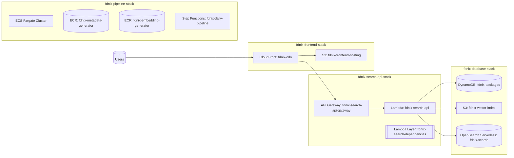

# fdnix CDK Infrastructure

This package contains the AWS CDK infrastructure definitions for the fdnix hybrid search engine. All AWS resources are prefixed with "fdnix-" for clear identification.

## Architecture Overview

The infrastructure consists of four main stacks:

1. **Database Stack** - Core data storage resources
2. **Pipeline Stack** - Data processing pipeline
3. **Search API Stack** - Lambda-based search API
4. **Frontend Stack** - Static site hosting with CloudFront

## Architecture Diagram



If Mermaid is unavailable, here is a compact textual view:

```
Users -> CloudFront (fdnix-cdn)
         ├─ S3 (fdnix-frontend-hosting)
         └─ API Gateway (fdnix-search-api-gateway)
                └─ Lambda (fdnix-search-api)
                       ├─ DynamoDB (fdnix-packages)
                       ├─ OpenSearch Serverless (fdnix-search)
                       └─ S3 (fdnix-vector-index)

Data Pipeline (fdnix-pipeline-stack)
  ├─ ECS Fargate Cluster
  ├─ ECR: fdnix-metadata-generator
  ├─ ECR: fdnix-embedding-generator
  └─ Step Functions: fdnix-daily-pipeline
```

## Prerequisites

- Node.js 18+ and npm
- AWS CLI configured with appropriate credentials
- AWS CDK CLI installed (`npm install -g aws-cdk`)
- Docker (for container builds in later phases)

## Installation

```bash
npm install
```

## Configuration

### Environment Variables

- `CDK_DEFAULT_ACCOUNT` - AWS account ID
- `CDK_DEFAULT_REGION` - AWS region (defaults to us-east-1)
- `FDNIX_DOMAIN_NAME` - Custom domain name (defaults to fdnix.com)

### AWS Prerequisites

Before deploying, ensure you have:

1. AWS CDK bootstrapped in your account/region:
   ```bash
   npx cdk bootstrap
   ```

2. Appropriate IAM permissions for creating:
   - DynamoDB tables
   - S3 buckets
   - Lambda functions
   - API Gateway
   - CloudFront distributions
   - ECS clusters and task definitions
   - OpenSearch Serverless collections
   - IAM roles and policies

## Deployment

### Deploy All Stacks

```bash
npm run deploy
```

### Deploy Individual Stacks

```bash
npx cdk deploy FdnixDatabaseStack
npx cdk deploy FdnixPipelineStack
npx cdk deploy FdnixSearchApiStack
npx cdk deploy FdnixFrontendStack
```

### View Planned Changes

```bash
npm run diff
```

### Synthesize CloudFormation Templates

```bash
npm run synth
```

## Stack Details

### Database Stack (`fdnix-database-stack`)

**Resources:**
- `fdnix-packages` - DynamoDB table for package metadata
- `fdnix-vector-index` - S3 bucket for Faiss vector indices
- `fdnix-search` - OpenSearch Serverless collection
- `fdnix-database-access-role` - IAM role for database access

**Key Features:**
- Point-in-time recovery enabled
- Deletion protection on DynamoDB table
- S3 versioning with lifecycle management
- Encryption at rest for all storage

### Pipeline Stack (`fdnix-pipeline-stack`)

**Resources:**
- `fdnix-processing-cluster` - ECS Fargate cluster
- `fdnix-metadata-generator` - ECR repository
- `fdnix-embedding-generator` - ECR repository
- `fdnix-daily-pipeline` - Step Functions state machine
- `fdnix-daily-pipeline-trigger` - EventBridge rule (daily at 2:00 AM)

**Key Features:**
- Orchestrated data processing pipeline
- Automated daily execution
- Containerized processing tasks
- CloudWatch logging and monitoring

### Search API Stack (`fdnix-search-api-stack`)

**Resources:**
- `fdnix-search-api` - Lambda function for hybrid search
- `fdnix-search-api-gateway` - API Gateway REST API
- `fdnix-search-dependencies` - Lambda layer for dependencies

**Key Features:**
- Hybrid vector + keyword search
- CORS enabled for frontend integration
- Rate limiting and usage plans
- Health check endpoint

**API Endpoints:**
- `GET /v1/search?q=<query>` - Main search endpoint
- `GET /v1/health` - Health check

### Frontend Stack (`fdnix-frontend-stack`)

**Resources:**
- `fdnix-frontend-hosting` - S3 bucket for static assets
- `fdnix-cdn` - CloudFront distribution
- `fdnix-oac` - Origin Access Control

**Key Features:**
- Global CDN with edge caching
- SSL/TLS termination with ACM certificate (optional; separate stack)
- Custom domain support (fdnix.com, www.fdnix.com)
- SPA routing support (404 → index.html)
- API proxying through CloudFront
 - DNS managed via Cloudflare

## Stack Dependencies

The stacks have the following dependencies:

```
DatabaseStack
├── PipelineStack
├── SearchApiStack
│   └── FrontendStack
```

## Outputs

Each stack exports key resource identifiers:

- **Database**: Table names, bucket names, collection endpoints
- **Pipeline**: Repository URIs, state machine ARN
- **API**: API URL, function name
- **Frontend**: Distribution ID, domain names, Cloudflare setup instructions

## Monitoring and Observability

- CloudWatch logs for all Lambda functions and ECS tasks
- CloudWatch metrics and alarms (can be extended)
- X-Ray tracing support (can be enabled)
- VPC Flow Logs for pipeline network traffic

## Security Features

- All S3 buckets block public access
- Encryption at rest for all storage services
- IAM roles follow least privilege principle
- OpenSearch Serverless with network policies
- CloudFront with security headers
- API Gateway with throttling and usage plans

## Cost Optimization

- Serverless-first architecture minimizes fixed costs
- DynamoDB on-demand pricing
- S3 lifecycle policies for old versions
- CloudFront edge caching reduces origin requests
- ECR lifecycle policies limit image storage

## Cleanup

To destroy all resources:

```bash
npm run destroy
```

**Warning:** This will permanently delete all data. Ensure you have backups if needed.

## Troubleshooting

### Common Issues

1. **Bootstrap Required**: Ensure CDK is bootstrapped in your account
2. **Permission Denied**: Verify IAM permissions for CDK deployment
3. **OpenSearch Policies**: OpenSearch Serverless policies can take time to propagate
4. **Custom Domain**: Ensure DNS records are properly configured

### Useful Commands

```bash
# List all stacks
npx cdk list

# View stack dependencies
npx cdk tree

# Check CDK version
npx cdk --version

# Validate templates
npx cdk synth --validation
```

## Cloudflare DNS & TLS Setup

After deployment, configure Cloudflare to point your domain to CloudFront and complete ACM validation:

1. **Get CloudFront domain**: From CDK outputs, copy the distribution domain (e.g., `dxxxx.cloudfront.net`).
2. **Create DNS records in Cloudflare**:
   - **CNAME (flattened) for apex**: Name `@` (fdnix.com) → target the CloudFront domain. Cloudflare will apply CNAME flattening at the apex. Enable proxy (orange cloud) if desired.
   - **CNAME for www**: Name `www` → target the CloudFront domain. Enable proxy (orange cloud) if desired.
3. **ACM certificate (us-east-1)**:
   - The dedicated `fdnix-certificate-stack` is created automatically.
   - Open the certificate in ACM and copy the DNS validation CNAMEs.
   - Add those CNAME validation records in your Cloudflare zone. Validation usually completes within minutes.
4. **Cloudflare SSL/TLS mode**: Set to "Full (strict)".

Notes:
- CloudFront only accepts ACM certificates in `us-east-1`. The CDK bin defaults to `us-east-1` to satisfy this.
- The frontend stack does not depend on the certificate. You can deploy the frontend immediately; the certificate may remain in Pending validation without blocking.

## Next Steps

After successful deployment:

1. **Set up Cloudflare DNS**: Configure DNS records as described above
2. **Phase 2**: Build and deploy data processing containers
3. **Phase 3**: Implement search Lambda function
4. **Phase 4**: Build and deploy SolidJS frontend
5. **CI/CD**: Set up automated deployments

## Support

For issues or questions:
- Check CloudFormation events in AWS Console
- Review CloudWatch logs
- Verify IAM permissions
- Ensure all prerequisites are met
