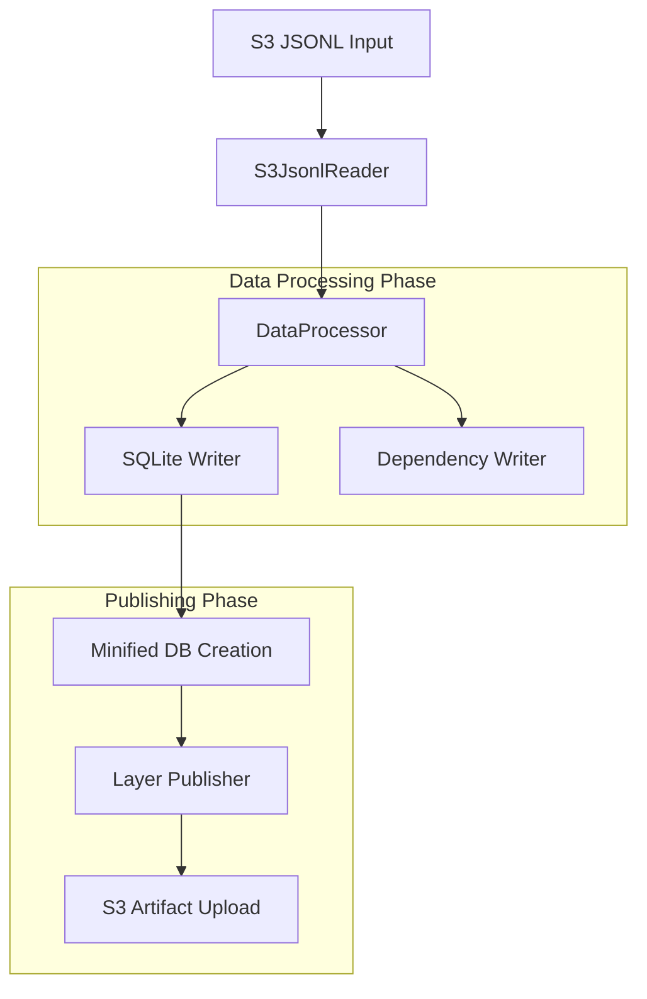
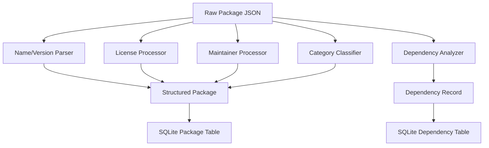

# nixpkgs-processor

A container-based data processing pipeline that transforms raw nixpkgs package metadata into searchable SQLite databases with full-text search capabilities for the fdnix search engine.

## Architecture Overview

This processor implements a multi-phase data transformation pipeline that converts nix-eval-jobs JSONL output into optimized SQLite databases with full-text search capabilities.



## Data Processing Pipeline

### Phase 1: JSONL Reading (`s3_jsonl_reader.py`)

Reads raw nix-eval-jobs output from S3:
- Downloads compressed JSONL files from S3
- Extracts metadata header with extraction timestamp and branch info
- Parses individual package records with error tolerance
- Returns structured package data and metadata

**Input Format**: JSONL with first line containing `_metadata` object followed by package records

### Phase 2: Data Processing (`data_processor.py`) 

Transforms raw nix package data into structured format:

#### Package Metadata Processing
- **Name/Version Parsing**: Extracts package name and version from nix name strings
- **License Normalization**: Handles complex license objects (string, array, object types)
- **Maintainer Processing**: Structures maintainer data with name, email, GitHub info
- **Category Classification**: Maps nixpkgs categories to user-friendly classifications
- **Platform Handling**: Processes supported platform lists
- **Status Flags**: Tracks broken, unfree, insecure, unsupported status

#### Dependency Processing
- **Store Path Analysis**: Extracts dependency names from Nix store paths
- **Build Input Classification**: Processes inputDrvs into buildInputs
- **Dependency Counting**: Calculates total dependency metrics
- **Relationship Mapping**: Creates package-to-dependency mappings



### Phase 3: Database Creation (`sqlite_writer.py`)

Creates optimized SQLite databases with normalized schema and FTS capabilities:

#### Normalized Database Schema

The database uses a normalized design to eliminate data duplication and improve storage efficiency:

**Lookup Tables:**
- **licenses**: Unique license information (short_name, full_name, spdx_id, url, is_free, is_redistributable, is_deprecated)
- **architectures**: Unique architecture names (~20 total systems like x86_64-linux, aarch64-darwin)
- **maintainers**: Unique maintainer information (name, email, github, github_id)

**Main Package Table:**
- **Core Fields**: package_id, package_name, version, attribute_path, description, long_description, homepage
- **Metadata Fields**: category, broken, unfree, available, insecure, unsupported
- **Search Fields**: main_program, position, outputs_to_install, content_hash

**Junction Tables:**
- **package_licenses**: Many-to-many relationship between packages and licenses
- **package_architectures**: Many-to-many relationship between packages and supported architectures  
- **package_maintainers**: Many-to-many relationship between packages and maintainers

**Package Variations Table:**
- **package_variations**: Specific package-system combinations with drv_path and outputs

#### Schema Diagram
```sql
-- Main packages table (one row per unique package)
CREATE TABLE packages (
    package_id TEXT PRIMARY KEY,
    package_name TEXT NOT NULL,
    version TEXT NOT NULL,
    -- ... other package metadata fields
);

-- Lookup tables for normalization
CREATE TABLE licenses (license_id INTEGER PRIMARY KEY, short_name TEXT UNIQUE, ...);
CREATE TABLE architectures (arch_id INTEGER PRIMARY KEY, name TEXT UNIQUE, ...);
CREATE TABLE maintainers (maintainer_id INTEGER PRIMARY KEY, name, email, github, ...);

-- Junction tables for relationships
CREATE TABLE package_licenses (package_id TEXT, license_id INTEGER, PRIMARY KEY(...));
CREATE TABLE package_architectures (package_id TEXT, arch_id INTEGER, PRIMARY KEY(...));
CREATE TABLE package_maintainers (package_id TEXT, maintainer_id INTEGER, PRIMARY KEY(...));

-- Package variations (package + system combinations)
CREATE TABLE package_variations (variation_id TEXT PRIMARY KEY, package_id TEXT, system TEXT, ...);
```

#### Normalization Benefits

**Storage Efficiency:**
- Eliminates duplicate JSON storage for licenses, architectures, and maintainers
- Reduces database size by ~90% compared to denormalized approach
- Integer foreign keys replace large JSON objects

**Query Performance:**
- Faster joins using integer foreign keys vs JSON parsing
- Optimized indexes on small lookup tables
- Efficient filtering by license, architecture, or maintainer

**Data Integrity:**
- Referential integrity ensures consistent relationships
- No duplicate license/architecture/maintainer entries
- Centralized metadata management

#### FTS Virtual Table Schema
- **Search Fields**: package_id, package_name, attribute_path, description, long_description, main_program
- **Content Storage**: Minimal (rowid reference only) - stores no actual content data
- **Index Type**: SQLite FTS5 virtual table for efficient full-text search

#### Index Creation
- **FTS Index**: Full-text search on all text fields with SQLite FTS5
- **Performance Indexes**: Regular indexes on package_name, category, and status fields
- **Normalized Indexes**: Optimized indexes on all lookup and junction tables for fast relationship queries

### Phase 4: Minified Database Creation (`minified_writer.py`)

Creates highly compressed SQLite databases using zstd dictionary-based compression for optimal storage efficiency:

#### Compression Architecture
- **Dictionary Training**: Samples package data to create optimized compression dictionary
- **Key-Value Storage**: Compressed package data stored as BLOBs in SQLite
- **FTS5 External Content**: Searchable metadata linked to compressed content
- **Artifacts**: Generates both `minified.db` and `shared.dict` files

#### Schema
```sql
-- Compressed key-value store
CREATE TABLE packages_kv (
    id TEXT PRIMARY KEY,
    data BLOB NOT NULL
);

-- FTS5 with external content linkage
CREATE VIRTUAL TABLE packages_fts USING fts5(
    id,
    name,
    description,
    content='packages_kv',
    content_rowid='id'
);
```

#### Compression Process
1. **Dictionary Training**: Analyze ~10,000 package samples to create optimal compression dictionary
2. **Data Compression**: Compress each package JSON using the trained dictionary
3. **Storage**: Store compressed BLOBs in key-value table with searchable metadata
4. **Optimization**: Apply VACUUM to minimize final database size

#### Benefits
- **High Compression Ratios**: Dictionary-based compression optimized for package data
- **Fast Search**: FTS5 with external content provides full-text search capabilities
- **Small Footprint**: Significantly reduced storage requirements
- **Built-in zstd**: Uses Python 3.14's native zstd module, no external dependencies

### Phase 5: Individual Node S3 Writing (`node_s3_writer.py`)

Creates individual JSON files for dependency viewer module:

#### Dependency Graph Processing (`dependency_graph.py`)
- **Graph Construction**: Builds NetworkX directed graph from package dependencies
- **Relationship Analysis**: Calculates direct and transitive dependencies/dependents
- **Graph Statistics**: Provides comprehensive dependency metrics
- **Circular Detection**: Identifies circular dependency cycles

#### Node File Generation
Each package becomes a separate S3 JSON file containing:
- **Core Metadata**: All SQLite fields (excluding embeddings/FTS)
- **Dependencies**: Direct and transitive dependency lists
- **Dependents**: Packages that depend on this package
- **Metrics**: Dependency counts and relationship statistics
- **Node Linking**: IDs for connecting nodes in dependency viewer

#### S3 Structure
```
s3://bucket/nodes/
├── index.json                 # Summary index with all packages
├── package1-1.0.0.json       # Individual package nodes
├── package2-2.1.3.json
└── ...
```

#### Performance Features
- **Parallel Upload**: Multi-threaded S3 uploads for faster processing
- **Batch Processing**: Efficient batching of S3 operations  
- **Clear Existing**: Optional cleanup of previous node files
- **Index Generation**: Creates searchable index of all nodes

### Phase 6: Minified Database Creation

Creates optimized subset for runtime:
- **Column Filtering**: Keeps only essential fields for search
- **Index Optimization**: Recreates FTS indexes
- **Size Reduction**: Removes debug/build-only metadata
- **Performance**: Optimized for query response time

### Phase 7: Layer Publishing (`layer_publisher.py`)

Publishes SQLite database as AWS Lambda layer:
- **Compression**: Packages single database file into ZIP
- **Version Management**: Updates Lambda layer versions
- **Deployment**: Makes layer available to search APIs

## Environment Configuration

### Required Variables
- `AWS_REGION`: AWS region for services
- `ARTIFACTS_BUCKET`: S3 bucket for input JSONL and SQLite artifacts
- `PROCESSED_FILES_BUCKET`: S3 bucket for stats JSON and per-package node JSON files
- `JSONL_INPUT_KEY`: S3 key for input JSONL file (must point to the evaluator's brotli-compressed `.jsonl.br`)

### Processing Control
- `PROCESSING_MODE`: `metadata` | `minified` | `both` (aliases `all`/`full` → `both`; default: `both`)
- `ENABLE_NODE_S3`: Enable/disable individual node S3 writing (default: `true`)
- `ENABLE_STATS`: Enable/disable writing aggregate stats JSON (default: `true`)

### Output Configuration
- `SQLITE_DATA_KEY`: S3 key for main database (defaulted if unset, backward compatible with `LANCEDB_DATA_KEY`)
- `SQLITE_MINIFIED_KEY`: S3 key for minified database (defaulted if unset, backward compatible with `LANCEDB_MINIFIED_KEY`)
- `STATS_S3_KEY`: S3 key for stats JSON (defaulted if unset)
- `NODE_S3_PREFIX`: S3 prefix for individual node files (default: `nodes/`)
- `CLEAR_EXISTING_NODES`: Clear existing node files before upload (default: `true`)
- `NODE_S3_MAX_WORKERS`: Max parallel threads for node uploads (default: `10`)

### Zstd Compression Configuration
- `ZSTD_DICT_SIZE`: Dictionary size in bytes for zstd compression (default: 65536)
- `ZSTD_SAMPLE_COUNT`: Number of package samples for dictionary training (default: 10000)
- `ZSTD_COMPRESSION_LEVEL`: zstd compression level (default: 3)

### Layer Publishing (optional)
- `PUBLISH_LAYER`: When `true`, publishes the minified database to the Lambda layer
- `LAYER_ARN`: Target Lambda layer ARN

## Container Deployment

Built on `nixos/nix` with Python 3.14 dependencies via Nix:
- SQLite for database storage with FTS5
- zstd for dictionary-based compression (built-in to Python 3.14)
- Brotli for S3 upload compression
- SQLAlchemy for database operations
- Boto3 for AWS integration  
- Pandas for data processing

Entry point: `python src/index.py`

## Artifacts

The processor generates the following artifacts:
- **Main Database**: Complete SQLite database with all package data
- **Minified Database**: Highly compressed SQLite database using zstd with shared dictionary
- **Compression Dictionary**: Shared dictionary file for optimal decompression
- **Stats JSON**: Comprehensive dependency and package statistics
- **Node Files**: Individual package JSON files for dependency viewer (optional)
- **Lambda Layer**: Compressed database packaged as AWS Lambda layer (optional)

## Build & Run (examples)

Build:
- `docker build -t fdnix/nixpkgs-processor packages/containers/nixpkgs-processor`

Run (reads evaluator output and generates SQLite artifacts):
- `docker run --rm \
    -e AWS_REGION=us-east-1 \
    -e ARTIFACTS_BUCKET=fdnix-artifacts \
    -e PROCESSED_FILES_BUCKET=fdnix-processed \
    -e JSONL_INPUT_KEY=evaluations/<ts>/nixpkgs-raw.jsonl.br \
    -e PROCESSING_MODE=both \
    fdnix/nixpkgs-processor`

## Error Handling

- **Graceful Degradation**: Continues processing on individual package failures
- **Incremental Recovery**: Supports resuming from partial failures
- **S3 Retry Logic**: Built-in retry for transient AWS errors
- **Validation**: Schema validation and data integrity checks
- **Logging**: Comprehensive logging for debugging and monitoring
