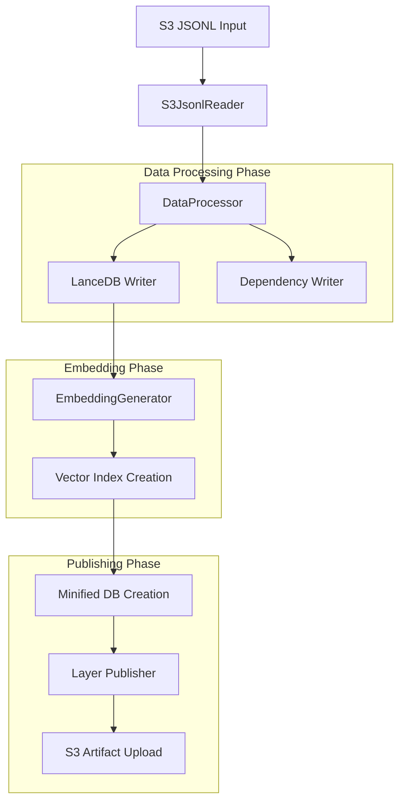
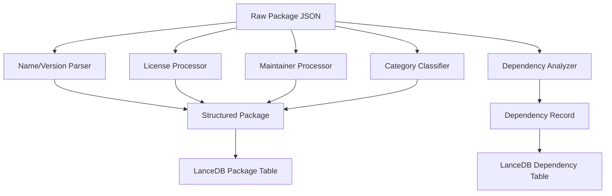
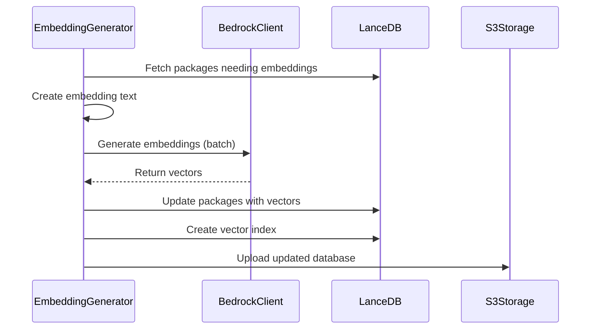

# nixpkgs-processor

A container-based data processing pipeline that transforms raw nixpkgs package metadata into searchable, embedding-enriched vector databases for the fdnix search engine.

## Architecture Overview

This processor implements a multi-phase data transformation pipeline that converts nix-eval-jobs JSONL output into optimized LanceDB vector databases with embedded semantic search capabilities.



## Data Processing Pipeline

### Phase 1: JSONL Reading (`s3_jsonl_reader.py`)

Reads raw nix-eval-jobs output from S3:
- Downloads compressed JSONL files from S3
- Extracts metadata header with extraction timestamp and branch info
- Parses individual package records with error tolerance
- Returns structured package data and metadata

**Input Format**: JSONL with first line containing `_metadata` object followed by package records

### Phase 2: Data Processing (`data_processor.py`) 

Transforms raw nix package data into structured format:

#### Package Metadata Processing
- **Name/Version Parsing**: Extracts package name and version from nix name strings
- **License Normalization**: Handles complex license objects (string, array, object types)
- **Maintainer Processing**: Structures maintainer data with name, email, GitHub info
- **Category Classification**: Maps nixpkgs categories to user-friendly classifications
- **Platform Handling**: Processes supported platform lists
- **Status Flags**: Tracks broken, unfree, insecure, unsupported status

#### Dependency Processing
- **Store Path Analysis**: Extracts dependency names from Nix store paths
- **Build Input Classification**: Processes inputDrvs into buildInputs
- **Dependency Counting**: Calculates total dependency metrics
- **Relationship Mapping**: Creates package-to-dependency mappings



### Phase 3: Database Creation (`lancedb_writer.py`)

Creates optimized LanceDB vector databases:

#### Package Table Schema
- **Core Fields**: package_id, package_name, version, attribute_path
- **Content Fields**: description, long_description, homepage
- **Metadata Fields**: license, maintainers, platforms, category
- **Status Fields**: broken, unfree, available, insecure, unsupported
- **Search Fields**: main_program, position, outputs_to_install
- **Vector Fields**: has_embedding, content_hash, vector (256-dim)

#### Dependency Table Schema
- **Identity**: package_id, pname, version, attribute_path
- **Dependencies**: build_inputs, propagated_build_inputs (JSON arrays)
- **Metrics**: total_dependencies count

#### Index Creation
- **FTS Index**: Full-text search on name, description, attribute_path
- **Vector Index**: IVF-PQ index with cosine distance for semantic search

### Phase 4: Embedding Generation (`embedding_generator.py`)

Generates semantic embeddings using AWS Bedrock:

#### Text Processing
Creates embedding text by combining:
- Package name and version
- Main program name  
- Description and long description
- Homepage URL
- License information
- Maintainer details
- Platform support
- Attribute path

#### Embedding Pipeline
- **Content Hashing**: Uses content hashes for incremental updates
- **Batch Processing**: Processes packages in configurable batches
- **Rate Limiting**: Respects Bedrock API limits
- **Incremental Updates**: Reuses existing embeddings for unchanged content
- **Vector Indexing**: Creates IVF-PQ indexes for fast similarity search



### Phase 5: Individual Node S3 Writing (`node_s3_writer.py`)

Creates individual JSON files for dependency viewer module:

#### Dependency Graph Processing (`dependency_graph.py`)
- **Graph Construction**: Builds NetworkX directed graph from package dependencies
- **Relationship Analysis**: Calculates direct and transitive dependencies/dependents
- **Graph Statistics**: Provides comprehensive dependency metrics
- **Circular Detection**: Identifies circular dependency cycles

#### Node File Generation
Each package becomes a separate S3 JSON file containing:
- **Core Metadata**: All LanceDB fields (excluding embeddings/FTS)
- **Dependencies**: Direct and transitive dependency lists
- **Dependents**: Packages that depend on this package
- **Metrics**: Dependency counts and relationship statistics
- **Node Linking**: IDs for connecting nodes in dependency viewer

#### S3 Structure
```
s3://bucket/nodes/
├── index.json                 # Summary index with all packages
├── package1-1.0.0.json       # Individual package nodes
├── package2-2.1.3.json
└── ...
```

#### Performance Features
- **Parallel Upload**: Multi-threaded S3 uploads for faster processing
- **Batch Processing**: Efficient batching of S3 operations  
- **Clear Existing**: Optional cleanup of previous node files
- **Index Generation**: Creates searchable index of all nodes

### Phase 6: Minified Database Creation

Creates optimized subset for runtime:
- **Column Filtering**: Keeps only essential fields for search
- **Index Optimization**: Recreates FTS and vector indexes
- **Size Reduction**: Removes debug/build-only metadata
- **Performance**: Optimized for query response time

### Phase 7: Layer Publishing (`layer_publisher.py`)

Publishes LanceDB as AWS Lambda layer:
- **Compression**: Packages minified database
- **Version Management**: Updates Lambda layer versions
- **Deployment**: Makes layer available to search APIs

## Environment Configuration

### Required Variables
- `AWS_REGION`: AWS region for services
- `ARTIFACTS_BUCKET`: S3 bucket for input JSONL and LanceDB artifacts
- `PROCESSED_FILES_BUCKET`: S3 bucket for stats JSON and per-package node JSON files
- `JSONL_INPUT_KEY`: S3 key for input JSONL file (must point to the evaluator's brotli-compressed `.jsonl.br`)

### Processing Control
- `PROCESSING_MODE`: `metadata` | `embedding` | `minified` | `both` (aliases `all`/`full` → `both`; default: `both`)
- `ENABLE_EMBEDDINGS`: Enable/disable embedding generation (default: `true` in code)
- `FORCE_REBUILD_EMBEDDINGS`: Regenerate all embeddings (default: `false`)
- `ENABLE_NODE_S3`: Enable/disable individual node S3 writing (default: `true`)
- `ENABLE_STATS`: Enable/disable writing aggregate stats JSON (default: `true`)

### Bedrock Configuration
- `BEDROCK_MODEL_ID`: Embedding model (default: `amazon.titan-embed-text-v2:0`)
- `BEDROCK_OUTPUT_DIMENSIONS`: Vector dimensions (default: `256`)
- `BEDROCK_MAX_RPM`: Rate limit (requests/minute)
- `PROCESSING_BATCH_SIZE`: Embedding batch size (default: `100`)

### Output Configuration
- `LANCEDB_DATA_KEY`: S3 key for main database (defaulted if unset)
- `LANCEDB_MINIFIED_KEY`: S3 key for minified database (defaulted if unset)
- `STATS_S3_KEY`: S3 key for stats JSON (defaulted if unset)
- `NODE_S3_PREFIX`: S3 prefix for individual node files (default: `nodes/`)
- `CLEAR_EXISTING_NODES`: Clear existing node files before upload (default: `true`)
- `NODE_S3_MAX_WORKERS`: Max parallel threads for node uploads (default: `10`)

### Layer Publishing (optional)
- `PUBLISH_LAYER`: When `true`, publishes the minified database to the Lambda layer
- `LAYER_ARN`: Target Lambda layer ARN

## Container Deployment

Built on `nixos/nix` with Python dependencies via Nix:
- LanceDB for vector storage
- Boto3 for AWS integration  
- Pandas for data processing
- AWS Bedrock SDK for embeddings

Entry point: `python src/index.py`

## Build & Run (examples)

Build:
- `docker build -t fdnix/nixpkgs-processor packages/containers/nixpkgs-processor`

Run (reads evaluator output and generates artifacts without embeddings):
- `docker run --rm \
    -e AWS_REGION=us-east-1 \
    -e ARTIFACTS_BUCKET=fdnix-artifacts \
    -e PROCESSED_FILES_BUCKET=fdnix-processed \
    -e JSONL_INPUT_KEY=evaluations/<ts>/nixpkgs-raw.jsonl.br \
    -e PROCESSING_MODE=both \
    -e ENABLE_EMBEDDINGS=false \
    fdnix/nixpkgs-processor`

## Error Handling

- **Graceful Degradation**: Continues processing on individual package failures
- **Incremental Recovery**: Supports resuming from partial failures
- **S3 Retry Logic**: Built-in retry for transient AWS errors
- **Validation**: Schema validation and data integrity checks
- **Logging**: Comprehensive logging for debugging and monitoring
